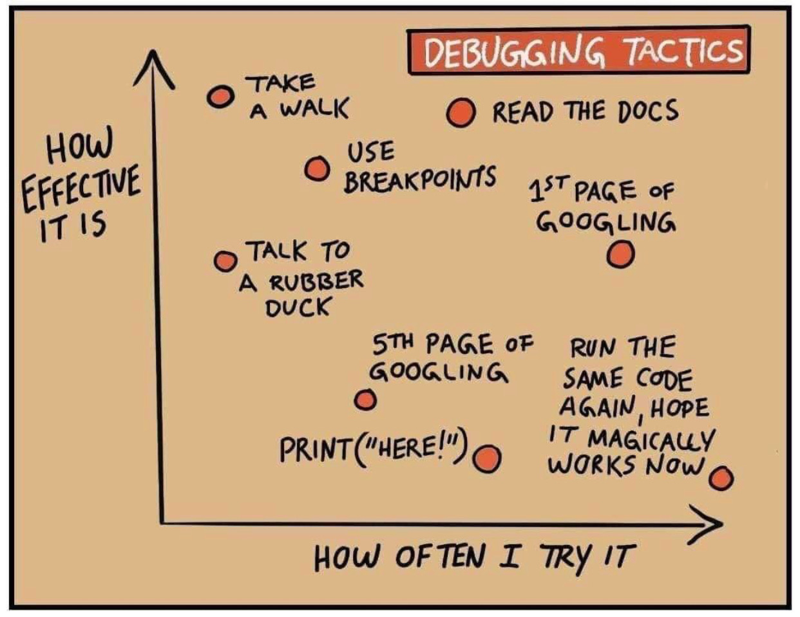

# Authentication Examples

This project shows how to perform two types of authentication:

- **JWT Authentication**: a server-side authentication using JSON Web Token open standard.
- **OAuth2 Authentication**: A client-side authentication using OAuth version 2 protocol to authenticate to Google.

This project is divided in a Node.js Server responsible for the JWT Authentication and a React client responsible for the OAuth2 authentication.

**Note:** This project handle only the main flow, alternative flows, like errors handling, are not covered and may present errors.

## Prerequisites

To run this project its necessary:

- A running MongoDB instance, i.e. [MongoDB Atlas](https://www.mongodb.com/cloud/atlas)
- An account in https://console.developers.google.com/ with a Application created (You can follow this [guide](https://theonetechnologies.com/blog/post/how-to-get-google-app-client-id-and-client-secret) to create an account and a applicattion).
  **Important:** in step 10, when asked to add _Authorized redirect URIs_, use `http://localhost:3000`

## Instalation

1. Clone this repository
2. Go to `server` folder and run:

```sh
npm i
```

3. Create a `.env` file with the following content:

```sh
PORT=4000
ENV=development
MONGODB_URI='<MongoDB connection string>'
SERVER_API_URL=http://localhost:4000/api
JWT_SECRET="<Random string used to crypt message>"
```

4. Start the server:

```sh
npm start
```

5. Go to `client` folder and run:

```sh
npm i
```

6. Create a `.env` file with the following content:

```sh
REACT_APP_GOOGLE_CLIENT_ID=<Client ID of your Google Developer Application>
REACT_APP_SERVER_API_URL=http://localhost:4000/api
```

7. Start the client:

```sh
npm start
```

You should see the authentication page loaded in your browser.

The web application has a login and a registration page, they comunicate with the server throught its API to perform the JWT authentication.

## How JWT Authentication Works

The authentication is performed by the Node.js server, based on users registered in a MongoDB instance, all the authentication process is handled by the [Passport](http://www.passportjs.org/) module. This module handles several types of authentication, the one used in this tutorial is the [Passaport JWT](http://www.passportjs.org/packages/passport-jwt/).

First, you need to register a new user, the `http://localhost/auth` route loads the registration form, the email and password is sent to the server throught a POST request to `/api/register` route.

The server receives the user information(`authRoutes.js` file) and checks if the email is already associated to another account, performing a search in MongoDB. If no user is found, a new one is created.

Next, a token is created based on the user information, this is done by `issueJWT` method in `utils.js`. First, a payload object with a `sub` property containing the new user ID and a `iat` containing the current time is created and passed to the function `jwt.sign` from `jsonwebtoken` module, this function signs the object using the `JWT_SECRET` as a secret key and generates a token object that will be returned to the client.

When the client receives the token information, a `useSaveRedirect` hook is responsible for storing it in the `localStorage` and redirect to a protected route(`/`). Protected routes should not be accessible without authentication, so these pages make requests to `/api/protected` route. This route validates the token, using `passport.authenticate` and returns if the token is valid or not. The client should use this information to allow the page loading or not.

The Login page shows a similar form that will perform the authentication of a pre-existent user. The client sends the user information to the `/api/login` route, where the email is used to search a user in MongoDB, if it is found, the password is compared with the one received from the request and the token generation is performed, like explained during registration.

## How Google Authentication Works

The React application is responsible for the communication with Google, possible due to the [React Google Login](https://www.npmjs.com/package/react-google-login) module, that provides A Google oAUth Sign-in / Log-in Component for React. In this case all the authentication process is performed by Google, the application trusts the logged user because trusts the information provided by Google.

The `GoogleLogin` component, when clicked, opens a pop-up with Google login page. After a successful authentication, Google redirects the browser back to the React application with a `profile` object with the user infomations, like name, image, etc. This object is then sent to a server route called '/api/login/google'. This route first try to find a user in MongoDB with the same email provided by the client in order to associate the Google Account to the user. If the user doesn't exists, a new one is created using the Google account information.

Two important information here are `providerId` and `provider`, the first one is the Google user ID and its responsible to keep the link between the two accounts, `provider` is a string field that stores the name of the authentication service, _Google_ in this casea, it is useful when several authentication providers are used, _Facebook_, _LinkedIn_, etc. [This article](https://medium.com/@alexanderleon/implement-social-authentication-with-react-restful-api-9b44f4714fa) has a complete example of authentication in mutiple services that use OAuth.

From now on, the process is the same from JWT authentication, the token is generated and stored in client's `localStorage`.

## Other Topics

- This project was built using [Tailwind CSS](https://tailwindcss.com/) and prepared to use [Styled Components](https://styled-components.com/), if you want to configure yourself you can follow [this tutorial](https://www.youtube.com/watch?v=FiGmAI5e91M)
- This project also uses React Icons, you can see more of them [here](https://react-icons.github.io/react-icons/).
- If you would like to see another project that uses hooks you can check my Iron Beers project [here](https://github.com/lotofcaffeine/ironbeers-hooks).
- To know more about hooks or routing in React you can check the [Official Hooks Documentation](https://reactjs.org/docs/hooks-intro.html) and the [React Router Documentattion](https://reacttraining.com/react-router/web/guides/quick-start).

<p align="center">
   
</p>
